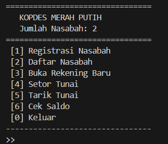
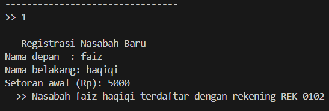
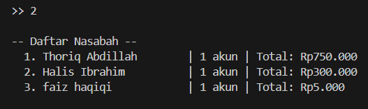
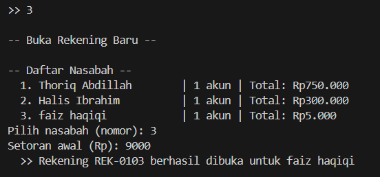
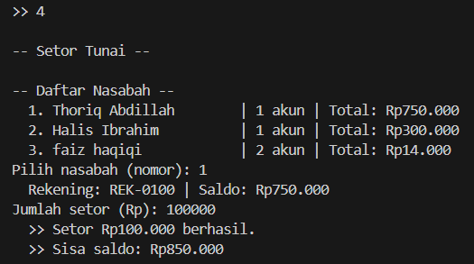
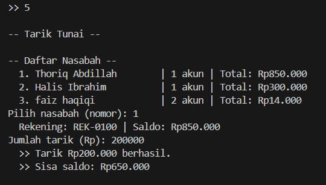
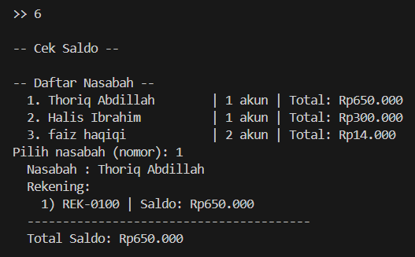

# Kopdes Merah Putih - Tugas Array & Methods (OOP)

**Nama:** [Thoriq Abdillah Falian Kusuma]
**NIM:** [F1D02410098]

## Deskripsi

Aplikasi simulasi perbankan berbasis terminal yang mendemonstrasikan penggunaan **Array Standar** dan **Methods** dalam paradigma Object-Oriented Programming menggunakan Java.

## Struktur Project

```
Bank/
├── Account.java     → Merepresentasikan rekening nasabah
├── Customer.java    → Merepresentasikan data nasabah beserta daftar rekeningnya
├── Bank.java        → Mengelola seluruh data nasabah dalam satu entitas bank
├── Main.java        → Entry point program, menyediakan menu interaktif
└── README.md
```

## Penjelasan Class

### Account
Menyimpan informasi satu rekening dengan nomor rekening otomatis (`REK-0100`, `REK-0101`, dst).

| Method        | Fungsi                      |
|---------------|-----------------------------|
| `setor(jml)`  | Menambah saldo              |
| `tarik(jml)`  | Mengurangi saldo            |
| `getSaldo()`  | Mengembalikan saldo terkini |
| `ringkasan()` | Menampilkan info rekening   |

### Customer
Menyimpan data nasabah dan mengelola **array of Account** (maks 5 rekening per nasabah).

| Method             | Fungsi                              |
|--------------------|-------------------------------------|
| `tambahAkun(akun)` | Menambahkan rekening ke nasabah     |
| `getAkun(idx)`     | Mengambil rekening berdasarkan index|
| `getJumlahAkun()`  | Jumlah rekening yang dimiliki       |
| `hitungTotalSaldo()`| Menjumlah saldo seluruh rekening   |

### Bank
Mengelola **array of Customer** (maks 10 nasabah) dengan pelacak `numberOfCustomers`.

| Method               | Fungsi                              |
|----------------------|-------------------------------------|
| `addCustomer(f, l)`  | Membuat dan menyimpan nasabah baru  |
| `getCustomer(idx)`   | Mengambil nasabah berdasarkan index |
| `getNumOfCustomers()`| Jumlah nasabah yang terdaftar       |

## Konsep OOP yang Diterapkan

### 1. Class & Object
Setiap entitas dunia nyata dimodelkan sebagai **class** (cetak biru), dan saat program berjalan, dibuat **object** (instance) dari class tersebut.

```java
// Class = cetak biru
public class Account { ... }

// Object = instance nyata yang dibuat dari class
Account rekening = new Account(750000);
```

Dalam program ini terdapat 3 class utama: `Account`, `Customer`, dan `Bank`, yang masing-masing merepresentasikan rekening, nasabah, dan bank di dunia nyata.

### 2. Encapsulation (Enkapsulasi)
Seluruh atribut class dideklarasikan sebagai `private`, sehingga tidak bisa diakses langsung dari luar class. Akses dan modifikasi data hanya bisa dilakukan melalui **method** (getter/setter).

```java
public class Account {
    private double saldo;           // tidak bisa diakses langsung dari luar

    public double getSaldo() {      // harus lewat method ini
        return saldo;
    }

    public void setor(double jml) { // modifikasi juga lewat method
        if (jml > 0) saldo += jml;
    }
}
```

### 3. Constructor
Setiap class memiliki **constructor** untuk menginisialisasi atribut saat object pertama kali dibuat.

```java
public Customer(String namaDepan, String namaBelakang) {
    this.namaDepan = namaDepan;
    this.namaBelakang = namaBelakang;
    this.daftarAkun = new Account[5];
    this.jumlahAkun = 0;
}
```

### 4. Static Member
Variabel `static` digunakan pada class `Account` sebagai penghitung global nomor rekening yang berlaku untuk semua object Account.

```java
private static int counter = 100;  // milik class, bukan milik satu object

public Account(double saldoAwal) {
    this.noRekening = "REK-" + String.format("%04d", counter++);  // auto-increment
}
```

## Konsep Array yang Diterapkan

### Array Standar (Bukan ArrayList)
Seluruh penyimpanan data menggunakan **array standar** (`[]`). Array standar memiliki ukuran tetap yang harus ditentukan saat inisialisasi.

```java
// Di Bank.java — menyimpan maksimal 10 nasabah
private Customer[] daftarNasabah = new Customer[10];
private int numberOfCustomers = 0;

// Di Customer.java — menyimpan maksimal 5 rekening per nasabah
private Account[] daftarAkun = new Account[5];
private int jumlahAkun = 0;
```

### Kenapa Perlu Variabel Counter?
Karena array standar tidak punya method `.size()` yang otomatis melacak jumlah elemen aktif, maka diperlukan variabel counter (`numberOfCustomers`, `jumlahAkun`) untuk:
- Mengetahui posisi kosong berikutnya saat **menambah** data
- Membatasi iterasi hanya pada elemen yang **sudah terisi**
- Mengecek apakah array sudah **penuh**

```java
// Menambah elemen ke array + increment counter
public void addCustomer(String namaDepan, String namaBelakang) {
    if (numberOfCustomers >= daftarNasabah.length) return;  // cek penuh
    daftarNasabah[numberOfCustomers] = new Customer(namaDepan, namaBelakang);
    numberOfCustomers++;
}
```

### Akses Elemen via Index
Elemen array diakses menggunakan index (dimulai dari 0). Method `getCustomer(idx)` dan `getAkun(idx)` menyediakan akses berdasarkan index dengan validasi batas.

## Cara Menjalankan

```bash
javac *.java
java Main
```

## Tampilan Menu

### 1. Registrasi Nasabah


### 2. Daftar Nasabah

### 3. Buka Rekening Baru

### 4. Setor Tunai

### 5. Tarik Tunai

### 6. Cek Saldo


